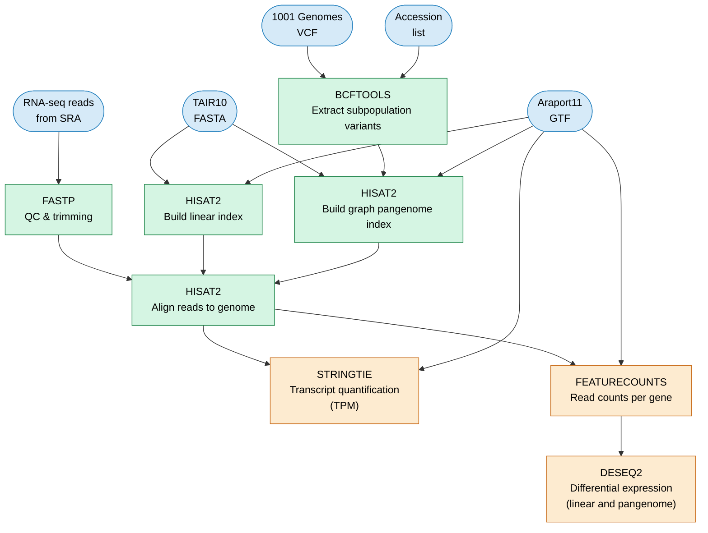

# Pangenome RNA-seq Analysis

This repository contains a Nextflow pipeline and analysis tools to investigate the impact of reference bias in RNA-seq experiments by comparing a linear reference (TAIR10) and a graph-based pangenome reference.

The project demonstrates how a pangenome reference can rescue read coverage for highly variant genes, leading to more sensitive differential gene expression (DGE) analysis in *Arabidopsis thaliana*.

## Project Overview

The analysis compares DGE results between:
1.  **Linear Reference**: TAIR10 (Col-0 accession).
2.  **Pangenome Reference**: A graph-based index constructed from TAIR10 and variants from 79 Asian accessions of the 1001 Genomes Project.

The study uses an RNA-seq dataset from [Bu et al, 2026](https://onlinelibrary.wiley.com/doi/10.1111/jipb.70231) involving drought stress response in the Ara-1 (Shahdara-1) accession.

## Pipeline Architecture

The analysis is automated using a Nextflow pipeline that handles reference preparation, QC, alignment, and quantification.



### Key Workflow Components
- **Nextflow & AWS Batch**: The pipeline is designed to run locally or at scale on AWS Batch.
- **Reference Construction**: Builds a HISAT2 graph index incorporating SNPs and indels.
- **Alignment**: Parallel alignment to both linear and pangenome references.
- **Quantification**: StringTie for TPM and featureCounts for raw gene counts.
- **DGE**: DESeq2 analysis for both reference branches.

## Offline Analysis & Reporting

The detailed comparison and visualization are performed in an offline analysis environment using Quarto and Python.

### Quarto Report
The primary analysis outcomes are documented in [reports/report.qmd](reports/report.qmd). It explores:
- DEG counts comparison between references.
- Coverage "rescue" ratios for variant genes.
- Per-base coverage visualization for top rescued genes (e.g., *ERF6*).

### Python Environment
The analysis uses Python 3.13 and is managed via `uv` or `pip`. Key dependencies include:
- `pandas` & `seaborn` for data manipulation and plotting.
- `pybigwig` & `pysam` for genomic data access.
- `quarto` for report generation.

To set up the environment:
```bash
uv sync
```

## Repository Structure
- `nextflow/`: Pipeline core logic and configuration.
- `reports/`: Quarto analysis scripts, Python dataloaders, and generated reports.
- `bin/`: Helper scripts for pangenome preparation and DGE.
